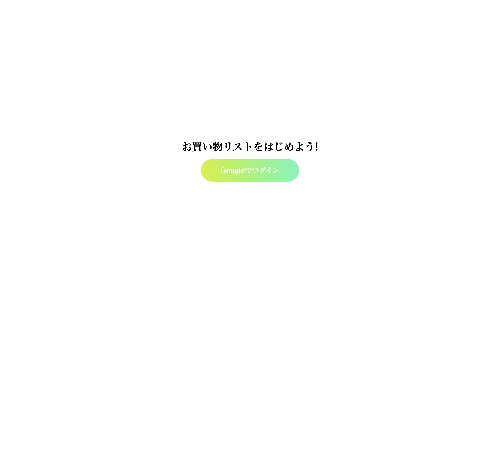
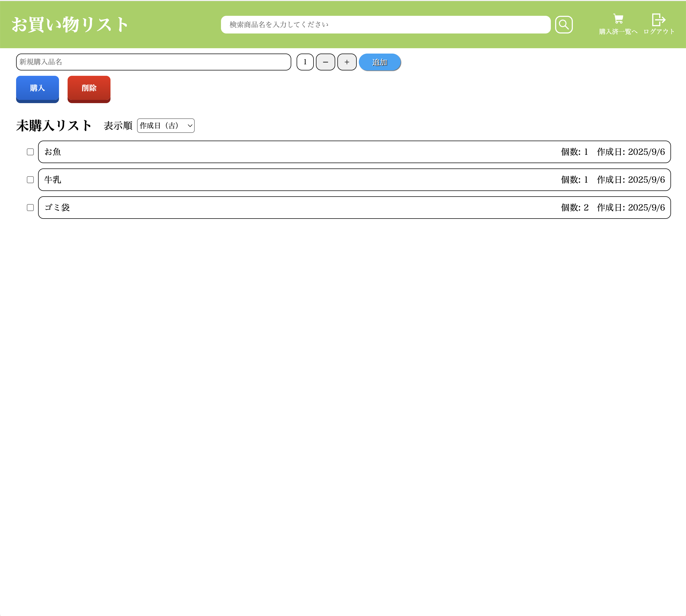
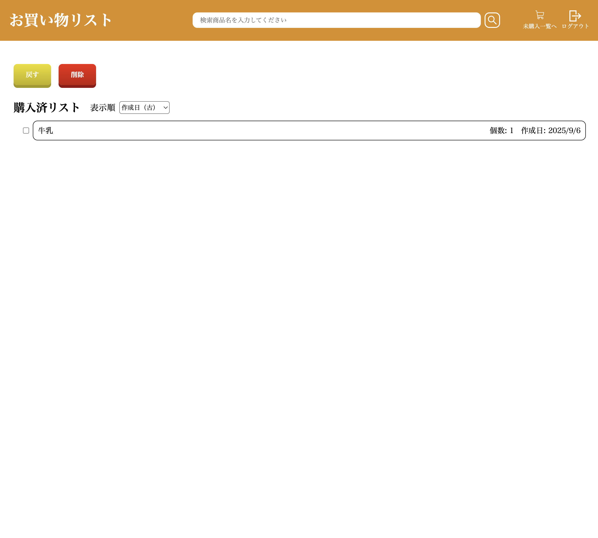
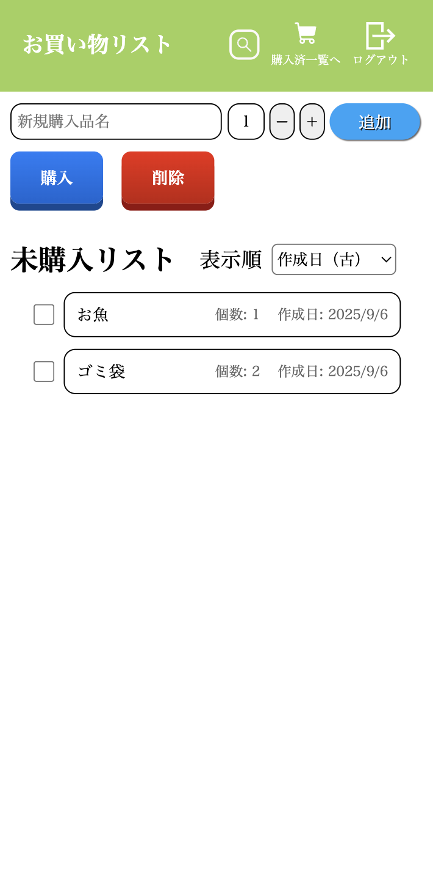
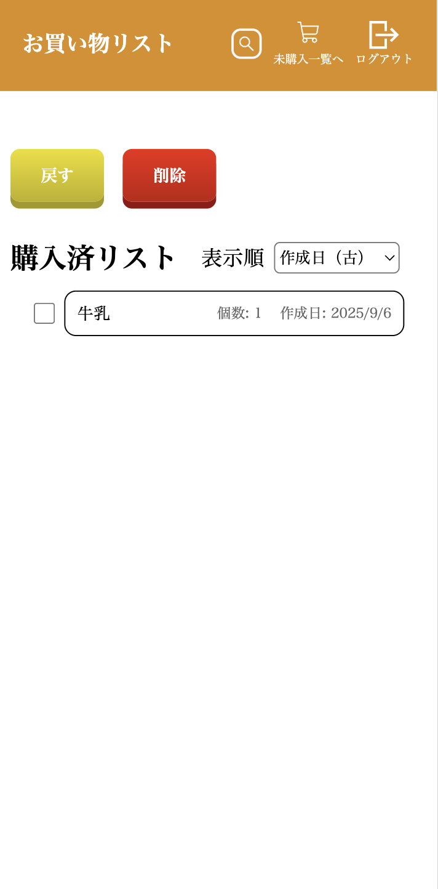

# Shopping List App

未購入・購入済みを管理できるショッピングリストアプリです。  
React + Vite + Firebase (Authentication / Firestore / Hosting) を使用しています。

---

## デモ
[公開URL]
(https://shopping-list-prod-8b864.web.app/)

### 画面例
#### PC版
<div style="display: flex; gap: 10px; flex-wrap: wrap;background-color: #f0f0f0; padding: 10px; border-radius: 8px;">
  
  
  
</div>

#### スマホ版
<div style="display: flex; gap: 10px; flex-wrap: wrap;background-color: #f0f0f0; padding: 10px; border-radius: 8px;">
  
  
  
</div>

---

## 機能
- Googleアカウントでログイン / ログアウト
- 未購入 / 購入済みリストの管理
- 商品の追加・戻す・編集・削除
- 作成日・名前・個数でのソート
- リアルタイムで Firestore と同期

---

## 技術スタック
- React + Vite
- Firebase
  - Authentication (Googleログイン)
  - Firestore (リアルタイムデータベース)
  - Hosting (公開用)
- SCSS
- React Icons

---

## ローカルでの起動方法

```bash
1. リポジトリをクローン
git clone https://github.com/username/shopping-list.git
cd shopping-list

2. 依存関係をインストール
npm install

3.Firebase の環境変数を設定
.env.example をコピーして .env を作成し、Firebase コンソールの情報を入力してください。

4.開発サーバーを起動
npm run dev

5.ブラウザで http://localhost:5173 を開く
